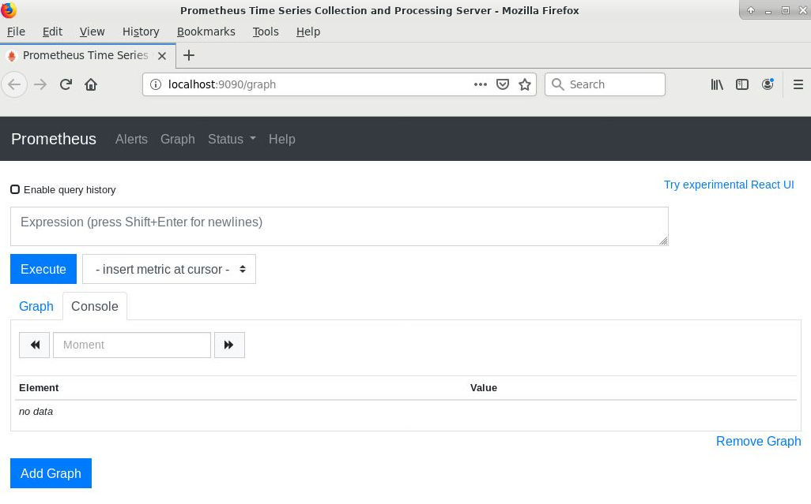
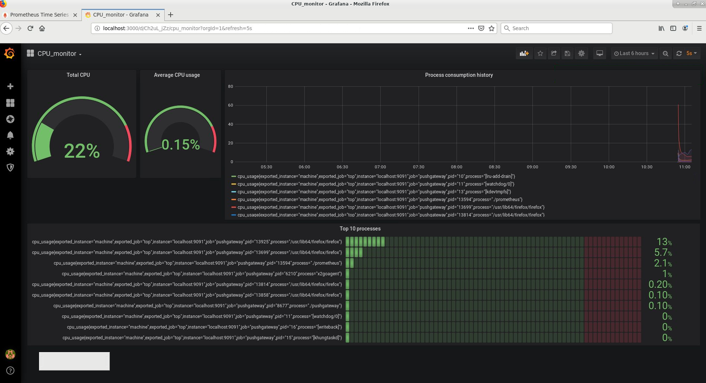

# CPU monitoring with Prometheus and Grafana

##  How to use Prometheus with a Pushgateway and a Grafana instance

### Description:
In this tutorial we will create a simple CPU monitoring interface with Grafana and Prometheus. We will be using the Pushgateway to use a push model, contrary to the typical pull-model used by Prometheus.

The following diagram shows how the system works:


### Tools and technologies: Linux, Bash, Prometheus, Grafana


> Adapted from this Medium article (thank you!): https://medium.com/schkn/monitoring-linux-processes-using-prometheus-and-grafana-113b3e271971 


### Operating system: Centos 7

## Install Pushgateway
```sh
wget https://github.com/prometheus/pushgateway/releases/download/v0.8.0/pushgateway-0.8.0.linux-amd64.tar.gz
tar xvzf pushgateway-0.8.0.linux-amd64.tar.gz 
cd pushgateway-0.8.0.linux-amd64/ 
./pushgateway &
```

The last command will start the Pushgateway as a background process


## Install Prometheus
```sh
wget https://github.com/prometheus/prometheus/releases/download/v2.17.1/prometheus-2.17.1.linux-amd64.tar.gz
tar xzvf prometheus-2.17.1.linux-amd64.tar.gz 
cd prometheus-2.17.1.linux-amd64
```

Modify the Prometheus configuration file (prometheus.yml). An example is provided in this repository. 
```sh
vim prometheus.yml
```

Modify and add the following options  (scrape_interval and alerting manager targets) :

```sh
# my global config
global:
  scrape_interval:     1s # Set the scrape interval to every 15 seconds. Default is every 1 minute.
  evaluation_interval: 15s # Evaluate rules every 15 seconds. The default is every 1 minute.
  # scrape_timeout is set to the global default (10s).

# Alertmanager configuration
alerting:
  alertmanagers:
  - static_configs:
    - targets: ['localhost:9090', 'localhost:9091']
      # - alertmanager:9093

```


And add the Pushgateway in the targets:

```sh
  - job_name: 'pushgateway'

    # metrics_path defaults to '/metrics'
    # scheme defaults to 'http'.

    static_configs:
    - targets: ['localhost:9091']

```


Start prometheus and check that it works properly
```sh
./prometheus &

firefox http://localhost:9090/graph 
```

You should be able to see the following



## Install and start Grafana 

##### Login and password are the defaults for Grafana
```sh
sudo yum install grafana-6.7.2-1.x86_64.rpm 
sudo systemctl status  grafana-server
sudo systemctl  start grafana-server
sudo systemctl status  grafana-server

firefox http://localhost:3000/
```

#### Configure Grafana with Prometheus as a datasource.


Now we want to have a script that sends data metrics to the Pushgateway. The Pushgateway is expecting key-value paris as input where the key represents the metric being monitored.

Example: 
cpu_usage  18


It is also possible to create more complicated commands with labels like the following:

cpu_usage{process="firefox", pid="8973"}  18


> This repository has two example of pushgateway metrics (random_metrics.sh and top-push.sh). They both are bash scripts that send the data to Pushgateway client which is then analyzed by Prometheus.

You need to start the push metrics script with a certain time interval. You can do this either with a cronjob or like the following;

```sh
while sleep 1; do ./top-push.sh; done; 
```


Check that you are receiving the data in Prometheus

```sh
firefox  http://localhost:9090
```

Type in the field "Expression" the name of your metrics, in this case: cpu_usage

You should now see both your keys (with/without labels) and the values.

## Grafana dashboard

You can import in Grafana the dashboard that is included in this repository (grafana_dashboard.json).

The final dashboard should look like the following:




License
----

**Free Software!**
For the benefit of everyone.


